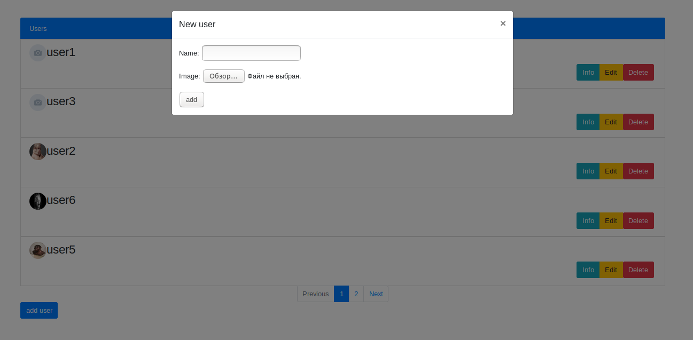
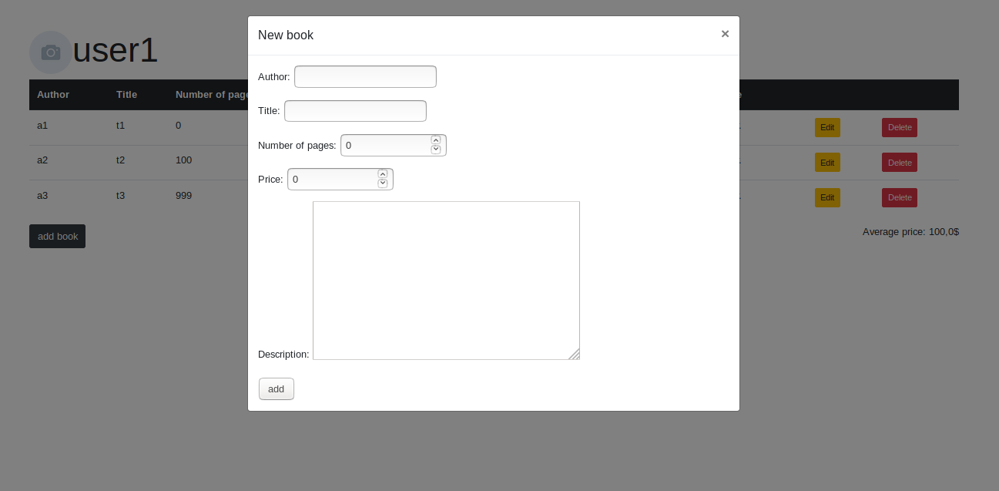

<h1>Задание</h1>
На главной странице отображаем список всех пользователей. В конце страницы 
форма добавления пользователя. При нажатии на имя пользователя переходим на 
страницу со списком книг, которые читает пользователь. В конце страницы - форма 
добавления новой книги, для текущего пользователя. При нажатии на название книги - 
переходим на форму редактирования этой книги.
<h2>Зависимости</h2>
<pre>
Python 3.7
PostgreSQL 11.2</pre>
Основные зависимости:
<pre>
Django==2.2.1
django-rest-framework==0.1.0
djangorestframework==3.9.3
psycopg2==2.8.2
pytz==2019.1
sqlparse==0.3.0
</pre>
Для установки зависимостей выполните следующию команду
<pre>pip3 install -r requirements.txt</pre>
<h2>Начало работы</h2>
Перед стартом выполните миграции
<pre>python manage.py makemigrations library
python manage.py migrate library</pre>
Для запуска сервера выполните следующую команду
<pre>python manage.py runserver</pre>
вас встретит главная страница со всеми пользователями

Копка <b>Add user</b> вызывает форму добавления нового пользователя

Нажав на любого пользователя появится список его книг

Копка <b>Add book</b> вызывает форму добавления новой книги

Нажав на любую книгу появится форма редактирования описания

<h2>Структура модели</h2>

модель содержит 3 класса
<pre>
Book
User
UserAndBook
</pre>
<b>Book</b>
характеризует книгу уникальными полями <em>author</em> и <em>title</em>
и имеет методы добавления новой книги, получения книги по полями <em>author</em>
и <em>title</em>, получения книги или создания в случае отсутствия данной книги по 
полями <em>author</em> и <em>title</em>.
<b>User</b> характеризует пользователя уникальным полем <em>name</em>, имеет
<em>ManyToManyField</em> связь с <b>Book</b> через <b>UserAndBook</b>
и имеет методы добавления нового пользователя, получения списка всех пользователей, получения пользователя по имени.
<b>UserAndBook</b> характеризует описание книги от конкретного пользователя через поле
<em>userDescription</em> и уникальные <em>ForeignKey</em> c <b>Book</b> и <b>User</b>,
имеет методы назначения книги для пользователя, получения списка книг пользователя с описанием,
редактирование описания к книге.