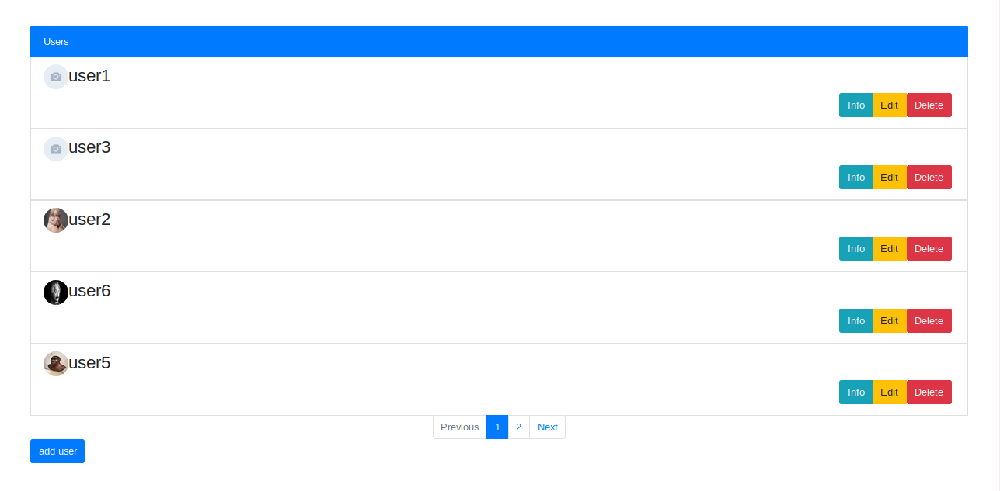
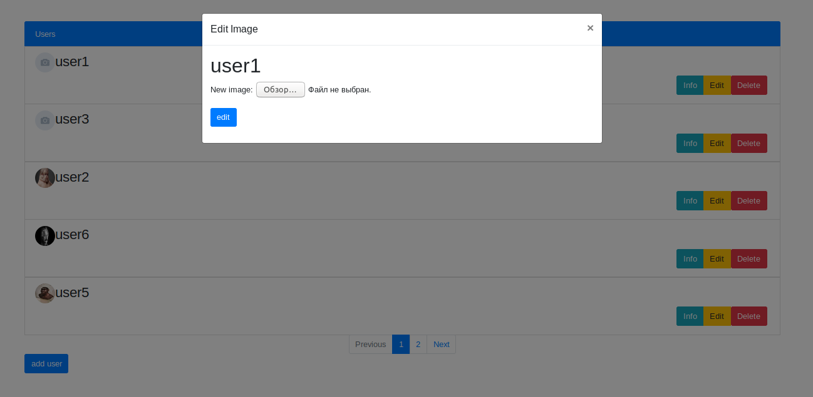

<h1>Задание</h1>
На главной странице отображаем список всех пользователей. В конце страницы 
форма добавления пользователя. При нажатии на имя пользователя переходим на 
страницу со списком книг, которые читает пользователь. В конце страницы - форма 
добавления новой книги, для текущего пользователя. При нажатии на название книги - 
переходим на форму редактирования этой книги.

 
<b>Дополнительные задания:</b>

1. Добавить аватарку юзеру.
2. Добавить кнопку удаления и изменения юзера.
3. Добавить валидацию на поля юзера.
4. Добавить книгам цену, количество страниц, дату создания, дату изменения.
5. Добавить книгам кнопки изменить и удалить.
6. Добавить пагинацию для пользователей (5 пользователей на странице).
9. Добавить среднюю цену всех книг юзера.

<h2>Зависимости</h2>
<pre>
Python 3.7
PostgreSQL 11.2</pre>
Основные зависимости:
<pre>
Django==2.2.1
django-rest-framework==0.1.0
djangorestframework==3.9.3
extras==1.0.0
Pillow==6.1.0
psycopg2==2.8.2
pytz==2019.1
sqlparse==0.3.0
</pre>
Для установки зависимостей выполните следующую команду
<pre>pip3 install -r requirements.txt</pre>
<h2>Начало работы</h2>
Перед стартом создайте базу данных в PostgreSQL с названием <b>library</b> и пользователя с именем <b>egor</b>
и паролем <b>3277</b>. 
Выполните миграции
<pre>python manage.py makemigrations library
python manage.py migrate library</pre>
Для запуска сервера выполните следующую команду
<pre>python manage.py runserver</pre>
вас встретит главная страница со всеми пользователями

Копка <b>Add user</b> вызывает форму добавления нового пользователя

У каждого пользователя есть 3 кнопки: информация о книгах, редактирование и удаление

Копка <b>Add book</b> вызывает форму добавления новой книги

У каждой книги есть 2 кнопки: редактирование описания и удаление

<h2>Структура модели</h2>

модель содержит 3 класса
<pre>
Book
User
UserAndBook
</pre>
<b>Book</b> характеризует книгу уникальными полями <em>author</em>, 
<em>title</em>, <em>price</em>, 
<em>number_of_page</em> и имеет методы: 
<ul>
<li>добавление новой книги;</li>
<li>получение книги;</li>
<li>получение книги или создание в случае отсутствия данной книги.</li>
</ul>

<b>User</b> характеризует пользователя уникальным полем <em>name</em> 
и изображением, которое может отсутствовать, имеет <em>ManyToManyField</em> 
связь с <b>Book</b> через <b>UserAndBook</b> и имеет методы:

<ul>
<li>добавление нового пользователя;</li>
<li>получение списка всех пользователей;</li>
<li>получение пользователя по имени;</li>
<li>изменение изображения;</li>
<li>удаление пользователя.</li>
</ul>

<b>UserAndBook</b> характеризует описание книги от конкретного пользователя через поле
<em>description</em>, дату добавления книги, дату редактирования описания 
и уникальные <em>ForeignKey</em> c <b>Book</b> и <b>User</b>,
имеет методы:
<ul>
<li>назначения книги для пользователя;</li> 
<li>получения списка книг пользователя с описание;</li>
<li>редактирование описания к книге;</li>
<li>удаление книги у пользователя.</li>
</ul>